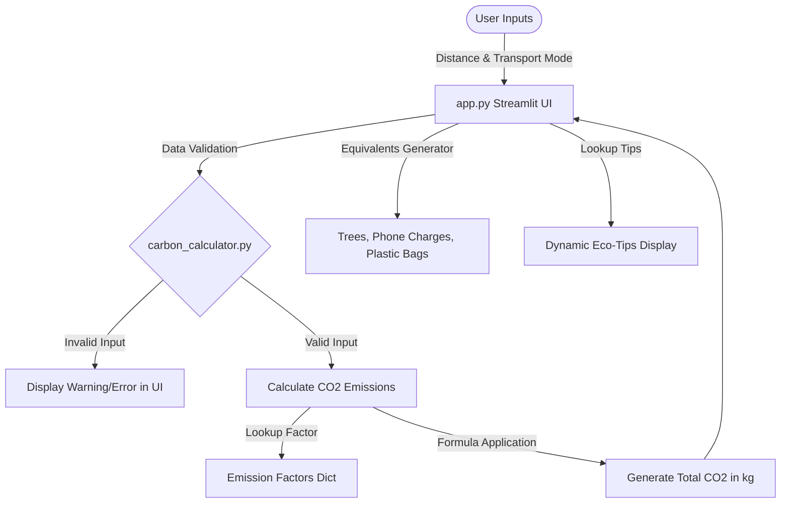

# 🌍 Carbon Footprint Estimator
[](https://www.python.org/)
[](https://streamlit.io/)
[](https://opensource.org/licenses/MIT)
[](http://makeapullrequest.com)
An interactive, modular, and production-ready Python web application that estimates travel-related carbon dioxide ($CO_2$) emissions. Built using **Streamlit** and styled with modern custom CSS (incorporating glassmorphism design patterns), this application helps users understand, quantify, and mitigate their environmental footprint.
---
## 📋 Table of Contents
- [Problem Statement](#-problem-statement)
- [Architecture & Data Flow](#-architecture--data-flow)
- [Core Programming Concepts Covered](#-core-programming-concepts-covered)
- [Project Structure](#-project-structure)
- [Mathematical Model](#-mathematical-model)
- [Installation & Local Setup](#-installation--local-setup)
- [Usage Guide](#-usage-guide)
- [Verification & Automated Tests](#-verification--automated-tests)
- [Contributing](#-contributing)
- [License](#-license)
---
## 🔍 Problem Statement
People are often unaware of the carbon footprint associated with their daily travel choices. This project addresses the challenge by providing a lightweight, transparent, and visually engaging tool to calculate travel emissions instantly, putting the results into real-world contexts and offering immediate, actionable mitigation steps.
---
## 🏗️ Architecture & Data Flow
The application follows a clean separation of concerns: **`carbon_calculator.py`** contains the mathematical model and business logic, while **`app.py`** serves as the interactive presentation layer.

---
## 🛠️ Core Programming Concepts Covered
This repository serves as a textbook implementation of essential Python concepts:
|
 Concept 
|
 Description 
|
 File & Line Mapping 
|
|
:---
|
:---
|
:---
|
|
**
Functions
**
|
 Modular execution blocks for calculating emissions and fetching recommendations. 
|
`carbon_calculator.py`
 (
`calculate_emissions`
, 
`get_reduction_tips`
) 
|
|
**
Dictionaries
**
|
 Key-value data structures storing emission coefficients and vehicle tips. 
|
`carbon_calculator.py`
 (
`EMISSION_FACTORS`
, 
`REDUCTION_TIPS`
) 
|
|
**
Calculations
**
|
 Arithmetic conversions from kilometers to kilograms of carbon dioxide. 
|
`carbon_calculator.py`
 (
`emissions = distance * factor`
) 
|
|
**
Validation
**
|
 Defensive programming checks verifying valid inputs (positive values, correct types). 
|
`carbon_calculator.py`
 (
`if distance < 0: raise ValueError(...)`
) 
|
---
## 📂 Project Structure
```bash
carbon/
├── carbon_calculator.py  # Mathematical engine & business logic
├── app.py                # Streamlit UI & Custom Glassmorphism CSS Styles
├── requirements.txt      # Dependency manifest
├── README.md             # Project documentation
└── scratch/
    └── test_calculator.py # Unit verification suite
```
---
## 🧮 Mathematical Model
The total carbon dioxide equivalent ($CO_2$) is computed using the distance traveled and a vehicle-specific emission factor:
$$E = d \times F_v$$
Where:
- $E$ is the total emissions in kilograms of $CO_2$ ($kg\text{ }CO_2$).
- $d$ is the travel distance in kilometers ($km$).
- $F_v$ is the carbon emission factor for the selected vehicle mode ($kg\text{ }CO_2 / km$).
### Emission Factors Used
The application references standard carbon conversion factors (Defra average estimates):
- **Petrol Car**: $0.18\text{ }kg\text{ }CO_2 / km$
- **Diesel Car**: $0.17\text{ }kg\text{ }CO_2 / km$
- **Electric Car**: $0.05\text{ }kg\text{ }CO_2 / km$
- **Motorcycle**: $0.10\text{ }kg\text{ }CO_2 / km$
- **Bus (per passenger)**: $0.03\text{ }kg\text{ }CO_2 / km$
- **Train (per passenger)**: $0.015\text{ }kg\text{ }CO_2 / km$
- **Short-haul Flight**: $0.15\text{ }kg\text{ }CO_2 / km$
- **Long-haul Flight**: $0.11\text{ }kg\text{ }CO_2 / km$
---
## 🚀 Installation & Local Setup
Follow these steps to set up the project in a clean local environment:
### 1. Clone the repository
```bash
git clone https://github.com/YOUR_USERNAME/carbon-footprint-estimator.git
cd carbon-footprint-estimator
```
### 2. Set up a virtual environment (Recommended)
```bash
# Create a virtual environment
python -m venv venv
# Activate it (Windows PowerShell)
.\venv\Scripts\Activate.ps1
# Activate it (Mac/Linux Bash)
source venv/bin/activate
```
### 3. Install requirements
```bash
pip install -U pip
pip install -r requirements.txt
```
### 4. Launch the dashboard
```bash
streamlit run app.py
```
---
## 📈 Usage Guide
1. Select your preferred transport type from the dropdown selector.
2. Enter the distance traveled (in kilometers).
3. The dashboard will automatically update in real-time to display:
   - **Carbon Footprint Metric**: Clear display of emissions in kg CO₂.
   - **Formula Card**: Transparent demonstration of the math applied.
   - **Impact Metrics**: Equivalent stats such as trees needed to absorb the carbon, equivalent smartphone charges, and manufacturing impact of plastic bags.
   - **Actionable Eco-Tips**: Tailored suggestions based on your choice.
---
## 🧪 Verification & Automated Tests
A dedicated test suite is available under the `scratch` directory to verify calculations, boundary limits, and input validations.
Run the unit tests:
```bash
python scratch/test_calculator.py
```
### Test Coverage Outputs:
```text
--- Running Carbon Calculator Tests ---
[PASS] Test Petrol Car (150 km) Passed: 27.0 kg CO2
[PASS] Test Train (1000 km) Passed: 15.0 kg CO2
[PASS] Test Flight Short-haul (200 km) Passed: 30.0 kg CO2
[PASS] Test Negative Distance Passed: Raised ValueError as expected ('Distance cannot be negative...')
[PASS] Test Invalid Transport Passed: Raised ValueError as expected ('Unknown transport type...')
[PASS] Test Electric Car Tips Passed: Found 4 tips
[SUCCESS] All Backend Unit Tests Passed Successfully!
```
---
## 🤝 Contributing
Contributions are welcome! Please follow these guidelines:
1. Fork the project.
2. Create your feature branch (`git checkout -b feature/AmazingFeature`).
3. Commit your changes (`git commit -m 'feat: Add some AmazingFeature'`).
4. Push to the branch (`git push origin feature/AmazingFeature`).
5. Open a Pull Request.
---
## 📄 License
This project is licensed under the MIT License - see the [LICENSE](LICENSE) file for details.
